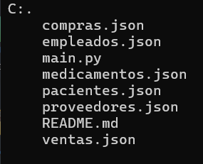
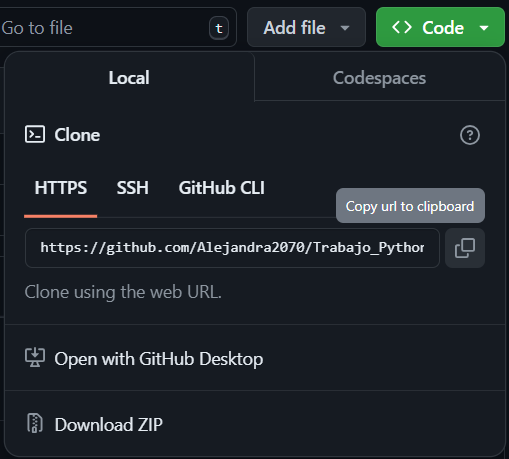
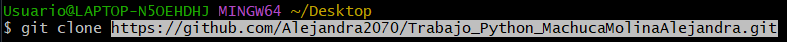

# Farmacia

Realización del trabajo asignado en clase.

## Descripción

Se creó un menú para facilitar al usuario el uso del programa. Se podrán registrar las ventas y compras realizadas de manera sencilla y organizada.

## Tecnologías utilizadas
| Pyhton |
|--|
||

## Estructura

## Características

| Nombre | Descripción |
|--|--|
| compras.json| Contiene la información de las compras realizadas. |
|empleados.json| Contiene la información de los empleados que hay en la panadería.|
|main.py| Contiene el código utilizado para la realización del programa.|
|medicamentos.json| Contiene la información sobre los medicamentos que hay en la farmacia, su precio y cantidad stock.|
|pacientes.json| Información de pacientes que han realizado compras en la farmacia.|
|proveedores.json| Información de los proveedores que suministran la farmacia.|
|README.md| Explicación del código y archivos utilizados para la realización de este.|
|ventas.json| Registro de las ventas realizadas en la farmacia.|

## Instrucciones

1. Copiar el enlace del repositorio

2. Clonar el repositorio

3. Abrir el archivo

## Desarrollado por

El trabajo fue desarrollado por Alejandra Machuca, estudiante de CampusLands Grupo T2.